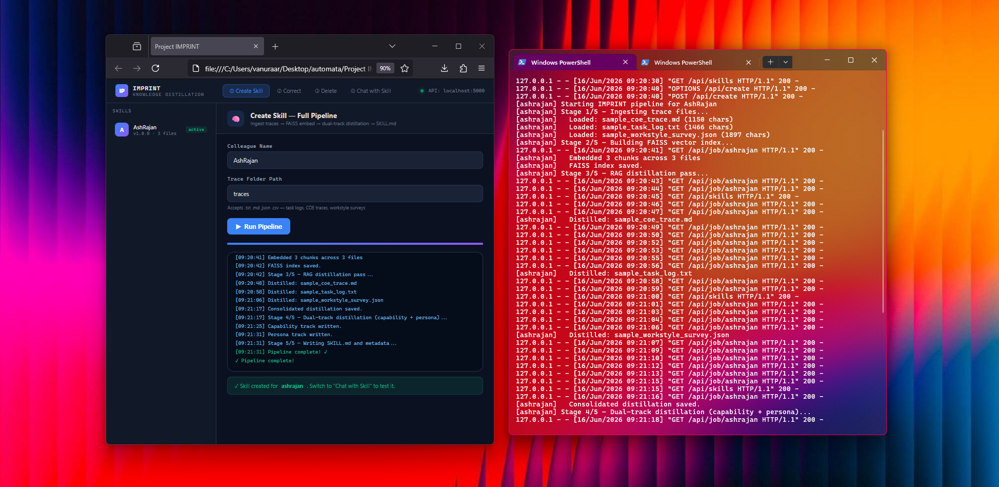
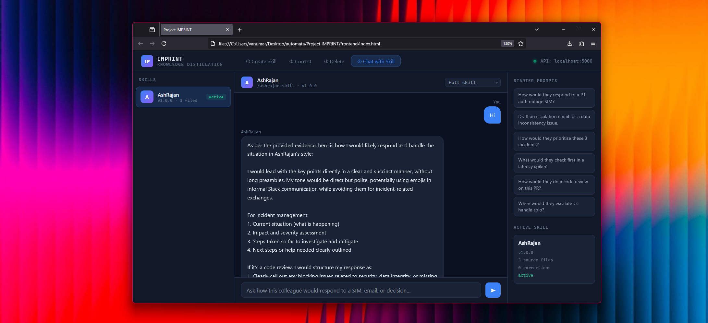

<div align="center">


# Project IMPRINT — M II

**Capturing Operational Expertise as Invokable AI Skills**

[](https://www.python.org/)
[](https://aws.amazon.com/bedrock/)
[](https://flask.palletsprojects.com/)
[](https://faiss.ai/)
[](LICENSE)

*Inspired by* **[COLLEAGUE.SKILL](https://arxiv.org/abs/2605.31264)** — *Zhou et al., 2026*

</div>

---

IMPRINT reads a colleague's raw work traces — SIM tickets, COE documents, CSV exports, task logs — and distills them into a structured, versioned **SKILL.md** artifact. The artifact encodes their decision heuristics, triage criteria, escalation patterns, and communication style. Once built, the skill can be queried via a RAG-backed chat interface or loaded into any compatible agent host.

---

## Inspiration

> *"Actionable knowledge tied to a person or role is typically buried in heterogeneous traces rather than written as clean instructions."*
>
> — Zhou et al., [COLLEAGUE.SKILL: Automated AI Skill Generation via Expert Knowledge Distillation](https://arxiv.org/abs/2605.31264) (arXiv:2605.31264)

The paper introduces a two-track skill packaging model — a **Capability Track** for decision heuristics and domain knowledge, and a **Behavior Track** for bounded communication style — along with a full lifecycle (create → correct → rollback → delete). IMPRINT is a ground-up implementation of those ideas, adapted for operational support workflows at Amazon scale, running entirely on AWS Bedrock.

---

## Pipeline

The five-stage LangGraph pipeline converts raw files into a deployable skill artifact:

```
traces/            FAISS         RAG              Dual-Track         Archive
[.md .csv .txt] → Embed ──────► Distil ─────────► Capability  ─────► SKILL.md
[.json]            (Titan v2)    (Claude 3)         Persona           manifest.json
                                                                      meta.json
```

| # | Node | What happens |
|---|------|-------------|
| 1 | **Intake** | Reads all supported files from the trace folder; saves raw corpus as JSON |
| 2 | **Embed + Index** | Chunks each document, embeds with Amazon Titan v2, builds a per-slug FAISS flat index |
| 3 | **RAG Distillation** | Retrieves top-k chunks per file; calls Claude on Bedrock to produce per-file summaries, then a consolidated master profile |
| 4 | **Dual-Track Distillation** | Splits the consolidated profile into a **Capability Track** (`work.md`) and a **Persona Track** (`persona.md`) |
| 5 | **Artifact Writer** | Assembles `SKILL.md`, `manifest.json`, `meta.json`; archives everything under `imprint_data/<slug>/` |

---

## Frontend

A dark-themed single-page UI is served directly by the Flask API — zero external dependencies, no build step.

### ① Ingest Knowledge — Create Skill



Enter a colleague name and the path to their trace folder, then hit **Run Pipeline**. A live terminal streams each stage's output with colour-coded log levels. A gradient progress bar advances as stages complete. On success the skill appears in the left sidebar and is immediately available for chat.

---

### ④ Chat with Skill



Select a skill and ask natural-language questions. The RAG engine retrieves the most relevant trace chunks, injects them alongside the full SKILL.md as context, and routes the prompt to Claude on Bedrock. Source-file tags appear under each response so every answer traces back to its evidence.

Three response modes:

| Mode | Uses |
|------|------|
| **Full skill** | Capability Track + Persona Track |
| **Capability only** | Heuristics, triage, escalation logic |
| **Style only** | Communication norms, response structure |

---

## Skill Artifact

Every completed pipeline produces three primary files:

```
SKILL.md
├── PART A — Capability Track
│   ├── Core Domain Expertise
│   ├── Decision Heuristics
│   ├── Triage Criteria
│   ├── Escalation Patterns
│   ├── COE / Lessons Learned
│   └── Task Workflows
├── PART B — Behavior Track  (bounded — not impersonation)
│   ├── Communication Style
│   ├── Response Structure Preferences
│   ├── Uncertainty Signalling
│   ├── Interaction Rules
│   ├── Escalation Communication
│   └── Correction History  ← patched via /api/correct
└── PART C — Operating Rules
    └── How agents should invoke Parts A and B
```

`meta.json` tracks lifecycle status (`draft → reviewed → active → archived`), correction count, and rollback history.  
`manifest.json` lists entrypoints, slash-command names, and compatible agent hosts.

---

## API Reference

The Flask server runs on `http://localhost:5000`.

| Method | Endpoint | Description |
|--------|----------|-------------|
| `GET` | `/api/skills` | List all skills — version, status, source count |
| `GET` | `/api/skill/<slug>` | Full metadata + SKILL.md preview |
| `POST` | `/api/create` | Start a pipeline run (non-blocking, returns `slug`) |
| `GET` | `/api/job/<slug>` | Poll pipeline status and streaming logs |
| `POST` | `/api/chat` | RAG-backed chat with a skill |
| `POST` | `/api/correct` | Append a natural-language correction record |
| `POST` | `/api/delete` | Permanently remove all artifacts for a slug |

**Chat request**

```json
POST /api/chat
{
  "slug":    "ashwath-rajan",
  "message": "How would they handle a P1 auth outage SIM?",
  "mode":    "full"
}
```

**Correction request**

```json
POST /api/correct
{
  "slug":   "ashwath-rajan",
  "scene":  "When reviewing a SIM for auth failures",
  "wrong":  "Escalates immediately to L6 without checking CloudWatch",
  "correct": "Checks CloudWatch logs first, rules out infra, then escalates with a full RCA summary"
}
```

Each correction archives the previous `persona.md`, bumps the patch version, and appends a timestamped record — giving a full audit trail.

---

## Governance

Every artifact is generated with the following defaults:

| Flag | Default | Meaning |
|------|---------|---------|
| `associate-owned` | `true` | The subject controls the artifact |
| `deletable` | `true` | Full deletion at any time, no questions asked |
| `local-first-storage` | `true` | Data never leaves the local machine |
| `not-for-performance-mgmt` | `true` | Cannot be used in performance reviews |
| `consent-obtained` | `false` | Must be flipped to `true` after colleague sign-off |

---

## Project Structure

```
Project IMPRINT - M II/
├── imprint.py               # LangGraph orchestration — 6-node pipeline graph
├── imprintAgents.py         # All agent functions (intake, embed, RAG, distill, artifact, archive)
├── imprint_api.py           # Flask REST API + background thread runner
├── frontend/
│   └── index.html           # Single-page UI — dark theme, no build step
├── imprint_data/
│   └── <slug>/              # Per-skill output (git-ignored)
│       ├── SKILL.md
│       ├── work.md
│       ├── persona.md
│       ├── consolidated.md
│       ├── faiss.index
│       ├── chunks.pkl
│       ├── manifest.json
│       └── meta.json
├── traces/                  # Input trace files — git-ignored
├── .env.example             # Credential template
├── .gitignore
└── requirements_imprint.txt
```

---

## Installation

**1. Clone and install dependencies**

```bash
git clone https://github.com/your-username/project-imprint.git
cd project-imprint
pip install -r requirements_imprint.txt
```

**2. Configure credentials**

```bash
cp .env.example .env
```

Edit `.env`:

```ini
AWS_ACCESS_KEY_ID=your_access_key_here
AWS_SECRET_ACCESS_KEY=your_secret_key_here
AWS_REGION=us-east-1
BEDROCK_MODEL_ID=anthropic.claude-3-sonnet-20240229-v1:0
IMPRINT_DATA_DIR=./imprint_data
```

> `.env` is git-ignored — never commit real credentials.

**3. Launch**

```bash
# API + UI
python imprint_api.py
# Open http://localhost:5000

# Or CLI only
python imprint.py
```

---

## Dependencies

| Package | Purpose |
|---------|---------|
| `boto3` / `botocore` | Amazon Bedrock — Claude 3 Sonnet inference + Titan Embed v2 |
| `faiss-cpu` | Vector index for RAG chunk retrieval |
| `numpy` | Embedding array operations |
| `flask` + `flask-cors` | REST API and static file serving |
| `python-dotenv` | `.env` credential loading |
| `langgraph` *(optional)* | Graph orchestration; a fallback stub runs without it |

---

## Reference

```bibtex
@article{zhou2026colleague,
  title   = {COLLEAGUE.SKILL: Automated AI Skill Generation via Expert Knowledge Distillation},
  author  = {Zhou, Tianyi and Liu, Dongrui and Yuan, Leitao and Shao, Jing and Hu, Xia},
  journal = {arXiv preprint arXiv:2605.31264},
  year    = {2026},
  url     = {https://arxiv.org/abs/2605.31264}
}
```
